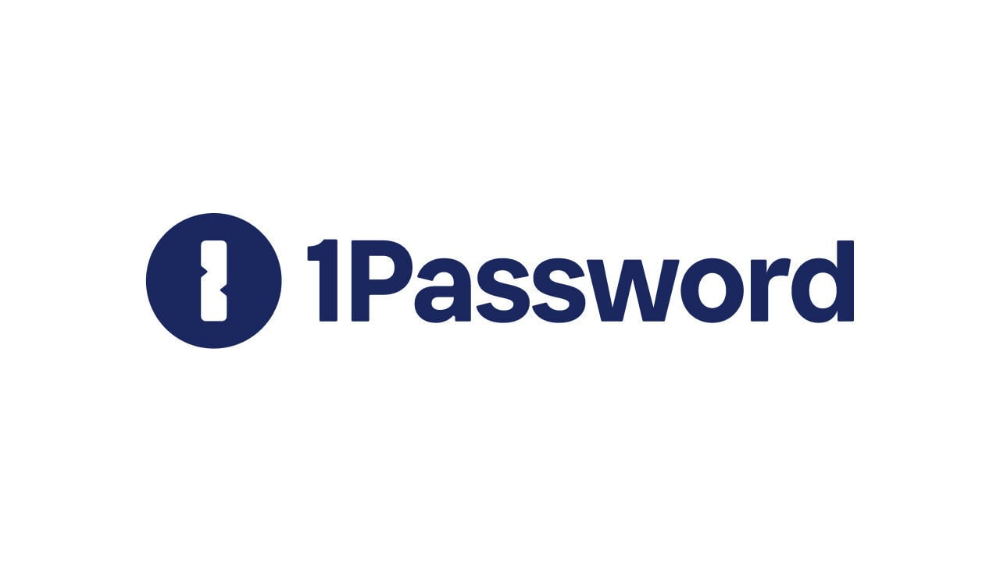
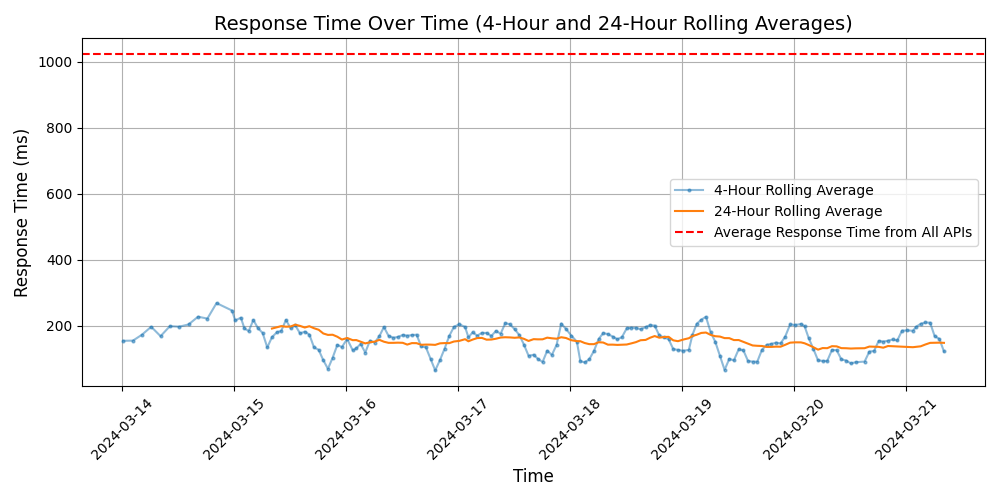
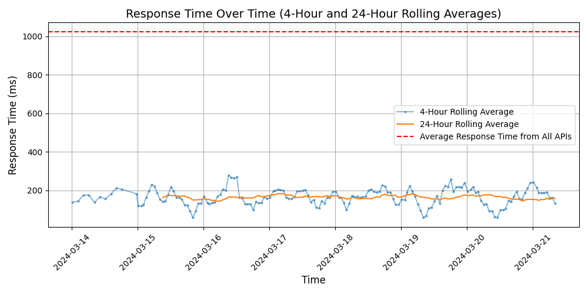

# [1Password](https://1password.com)

Trusted by more than 100,000 businesses to protect their data, 1Password gives you complete control over passwords and other sensitive business information. 

As an integral layer of the Identity and Access Management (IAM) stack, 1Password protects all employee accounts – even those you aren't aware of. Give employees secure access to any app or service and safely share everything you need to work together – including logins, documents, credit cards, and more – while keeping everything else private.

1Password is easy to deploy and integrates with Azure AD, Okta, OneLogin, and Slack, so you can automatically provision employees using the systems you already trust. It's simple to manage and fits seamlessly into your team's workflow, so you can secure your business without compromising productivity.

## Response Times

#### [billing.1password.com](https://billing.1password.com)

#### [billing.b5test.eu](https://billing.b5test.eu)

