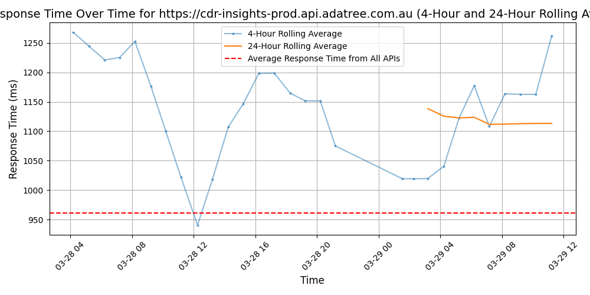

# [Adatree](https://adatree.com.au)

Adatree is a CDR technology intermediary. What does that mean? Simply put, we're the poles and wires connecting Banking, Finance, Energy and Telecommunications with Open Data. Our platform is ready for implementation with out-of-the-box functionality to have you connected to compliant data within a matter of weeks. The new age of data regulations are changing the way FinTech operates. Adatree is your on-ramp to stay plugged into the digital economy.

We work with organisations of all sizes and sectors to provide turnkey solutions. We've built a world-class CDR intermediary platform that is the most robust and flexible in market, ready to scale for any Open Data use case. If the scores of awards don't prove it, our list of satisfied clients ought to.

When you work with Adatree you're working with genuine CDR experts. We live and breathe this stuff, and strive to make it easy for other businesses to access consumer data with confidence.

We'll help you:
- Determine which CDR access model is best for your organisation
- Implement our fully-compliant white-labelled consent dashboard, tailored to your unique business needs
- Meet all compliance and legislative requirements including authentication and consent
- Leverage the full CDR ecosystem with every available API
- Accelerate your time-to-market to weeks (not months!) with our proven streamlined integration process
- Maintain consistent and secure connections to the Consumer Data Right network

We know the Consumer Data Right back-to-front and promise to walk you through every stage of the journey. Ready to take the first step?

Reach out to our team today: https://www.adatree.com.au/contact

## Response Times

#### [cdr-insights-prod.api.adatree.com.au](https://cdr-insights-prod.api.adatree.com.au)

