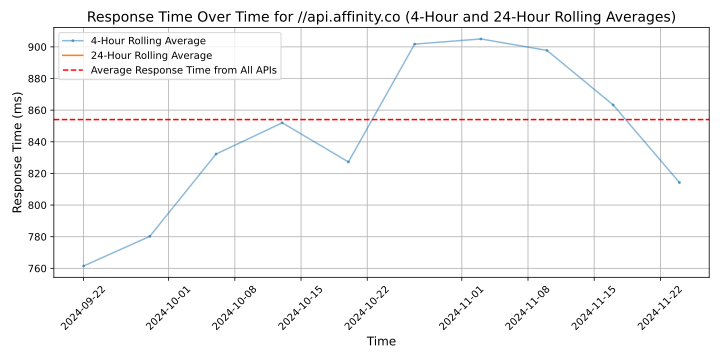

# [Affinity](https://affinity.co)

Affinity's patented technology structures and analyzes millions of data points across emails, calendars, and third-party sources to offer users the tools they need to automatically manage their most valuable relationships, prioritize important connections, and discover untapped opportunities. Affinity uses artificial intelligence to analyze relationship strength and illuminate the best paths to warm introductions. The platform also offers a holistic view of users' networks in a centralized, automatically updated database without any manual upkeep. Founded in 2014, Affinity is headquartered in San Francisco, California.

Affinity has raised $120M to date and is backed by leading investors including Menlo Ventures, Advance Venture Partners, 8VC and MassMutual Ventures.

It has over 2,700 customers in 70 countries, including venture capital firms such as Bain Capital Ventures and Kleiner Perkins, private equity firms such as SoftBank Group, investment bankers such as Woodside Capital Partners, financial services firms such as Fidelity Investments, real estate companies such as Tishman Speyer, insurers such as American Family Insurance and enterprises such as Nike, Qualcomm and Twilio.

Affinity has been named in Fortune Magazine's Best Workplaces, Inc. Magazine's Best Workplaces and editor's number one pick, the Data Breakthrough Award, BIG Innovation Award and others.

## Response Times

#### [//api.affinity.co](https:////api.affinity.co)

