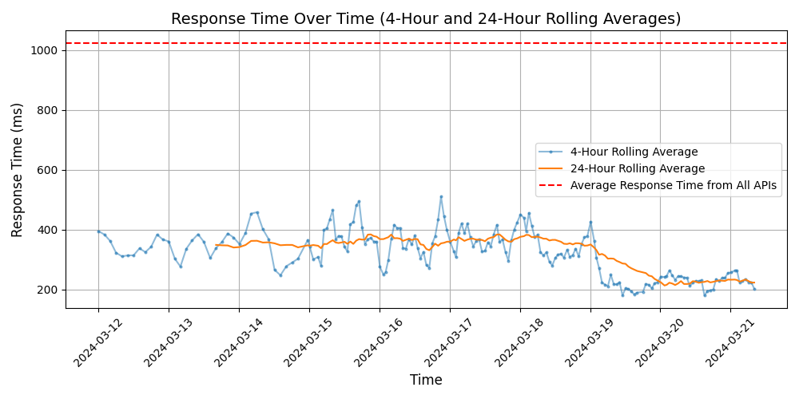

# [Asana](https://asana.com)

Asana helps teams orchestrate their work, from small projects to strategic initiatives. Headquartered in San Francisco, CA, Asana has more than 131,000 paying customers and millions of free organizations across 190 countries. Global customers such as Amazon, Japan Airlines, Sky, and Affirm rely on Asana to manage everything from company objectives to digital transformation to product launches and marketing campaigns. For more information, visit www.asana.com.

## Response Times

#### [app.asana.com/api/1.0](https://app.asana.com/api/1.0)

