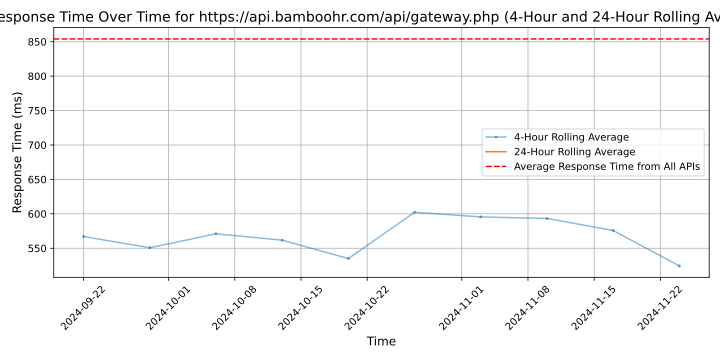

# [BambooHR](https://bamboohr.com)

Serving more than 34,000 customers and 3 million employees, BambooHR is the leading software provider powering the strategic evolution of HR in small and medium businesses.

BambooHR's cloud-based system is an intuitive, affordable way for growing companies to manage essential employee information in a personalized Human Resources Information System (HRIS). Its software sets HR free to do great work and be more strategic, which helps the entire organization do the same. BambooHR's clients include innovators like SoundCloud, Foursquare, Freshbooks, Stance, Reddit, Magnolia Homes, and others in more than 100 countries and 8 languages worldwide. To find out more, visit bamboohr.com or follow on Twitter at @bamboohr.

## Response Times

#### [api.bamboohr.com/api/gateway.php](https://api.bamboohr.com/api/gateway.php)

