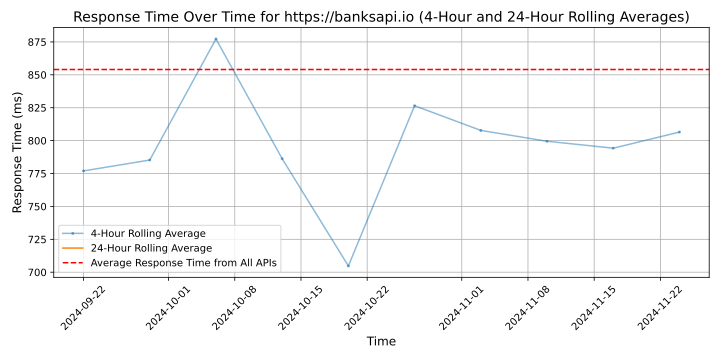

# [BANKSapi](https://banksapi.de/en)

We develop and operate REST-APIs and GUIs all around the topic of finance. As a specialised connectivity and payment provider, we are fully dedicated to the growth areas of Open Banking and Open Finance.

To make this possible, we provide account information and offer payment initiation services on our regulated and secure platform as a payment institution approved by the German authorities (BaFin).

Due to our advanced, AI-based data analytics, we offer high-performance value-added services for a wide range of use cases (e.g. contract recognition, age verification, KYC light based on account data or affordability checks).

In addition, we realise and operate your personal finance or business finance application as a web portal or mobile app cost-effectively with our front-end technology platform.

With our SaaS and ASP solutions, we maximally reduce complexity for our clients from a multitude of industries (e.g. insurance companies, ERP & accounting, financial advisory) and enable new use cases and business models for them.

BANKSapi Technology GmbH is a venture of Finconomy AG.

Imprint: https://banksapi.de/impressum/

## Response Times

#### [banksapi.io](https://banksapi.io)

