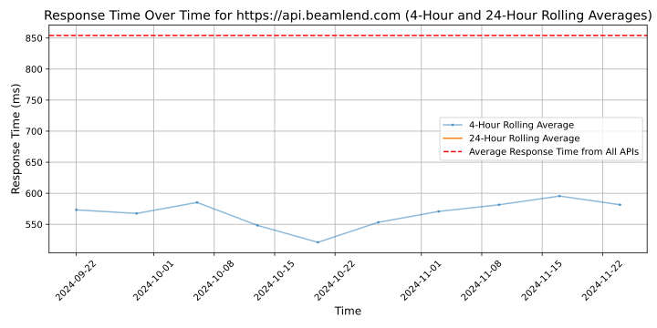

# [Beam](https://beamlend.com)

Beam is the intelligent way to manage risk with laser precision in real time.

Beam's state-of-the-art software solution sources traditional and alternative data to give you a real-time affordability analysis of your customer and makes manual analysis, fragmented data sources, high costs and slow processes a thing of the past so that you and your team get better data with sharper insight.

Beam makes it easy and seamless to access multiple data sources like bank statements from multiple accounts, bureau data and alternative data for thin-file customers, giving you the most up-to-date and precise view of your customer's financial position so that your organisation can make accelerated credit decisions.

Our completely digital customer onboarding process allows for near-instant credit approval.

Beam's API-first solution reduces credit decision-making time from days to seconds while helping you forecast your customer's income and expenses instantly. Beam Console's audit-ready reporting dashboard lets your admin, risk and underwriting teams easily and efficiently manage your customer data from one place.

## Response Times

#### [api.beamlend.com](https://api.beamlend.com)

