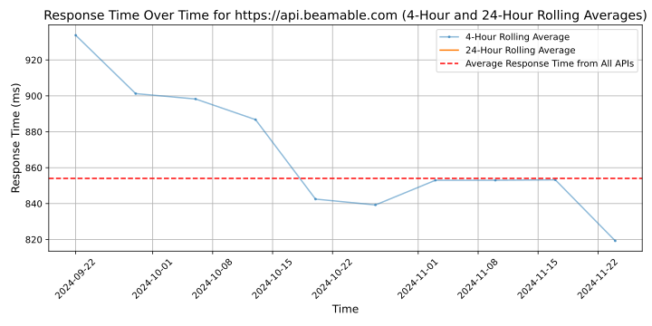

# [Beamable](https://beamable.com)

var Beamable = BeamContext.Default; - That one line of code is a gateway to everything you need to build custom server logic via microservices along with a world of LiveOps tools and live services to build games that players love.

## Response Times

#### [api.beamable.com](https://api.beamable.com)

