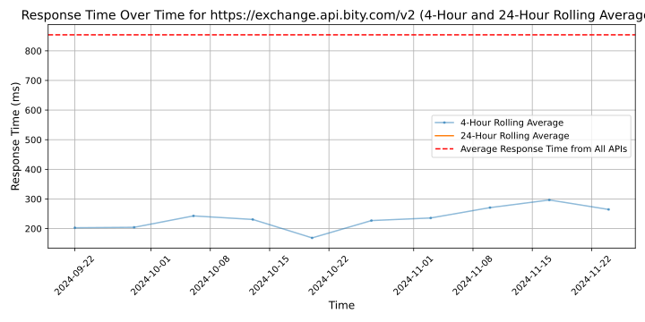

# [Bity](https://bity.com)

Bity provides crypto finance services and products for individuals and businesses all over the world. We work as an exchange between cryptocurrencies and fiat money through the blockchain.

What We Do

We offer a cryptocurrency exchange platform, a network of BTMs / CTMs (cryptocurrency teller machines) in Switzerland, crypto to fiat and fiat to crypto online bill pay and money transfer solutions, APIs for businesses, over-the-counter trading and affiliate programs.

Who We Are

Founded in January 2014, our company, as a Swiss-based FinTech startup, is positioned at the intersection of finance, technology and innovation. We connect people with the collaborative economy by simplifying the conversion from traditional money into cryptocurrencies and Blockchain assets.

Our Mission: To build a universal cryptocurrency gateway that provides secure and reliable products and services.

Our Goal: To empower digital nations.

Why Choose Us

As a Swiss company, we manage ourselves within a legal environment, with a high regard for data protection and privacy, and a strong financial ecosystem.

Some other benefits of choosing us as your crypto finance services provider include:

- Compliance: Audited by KPMG, Oversight by Swiss regulators, Swiss Digital Finance Compliance Association (DFCA) Member. fully licensed and registered brokerage.
- Years spent building trusted and reliable Swiss and European banking partnerships.
- We provide a platform accepting multiple currencies: cryptocurrencies (BTC, ETH), digital assets (REP), and fiat (EUR, CHF) with easy integration for developers (API).
- We are a secure and reliable link between traditional finance and blockchain economy.
- We focus on privacy, automation, and delivering our crypto products and services with the highest quality Swiss standards in everything we do.

We are the Swiss gateway to cryptocurrencies for a decentralized future.

Visit us on the web at https://bity.com
Follow us on Twitter: @Bity or Facebook.com/hello.bity

## Response Times

#### [exchange.api.bity.com/v2](https://exchange.api.bity.com/v2)

