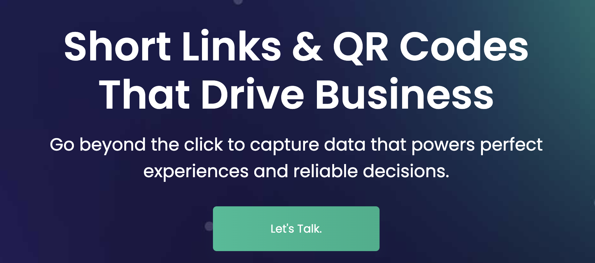

# [BL.INK](https://www.bl.ink)

BL.INK powers shortened URLs and QR codes with unlimited data and flexibility.

With BL.INK, you'll create thousands of custom links that capture unlimited data points so you can measure every user touchpoint and perfect every interaction.

Everyone on your team can create perfect data to accurately measure every element of marketing attribution. Every customer than visits your link gets the information they need, every time, with no broken links.

Need to change the link when a contest ends, or show the page in the user's own language? It's easy with BL.INK.

No other URL shortener or QR code creator integrates with your existing tools, helps you avoid broken links, enables zero down-time when updating links, and has a platform built based on how enterprise companies work. Only BL.INK. Trusted by demanding global brands since 2008.

