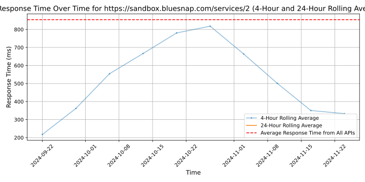

# [BlueSnap](https://www.bluesnap.com)

At BlueSnap, we look at payments a little differently. Our Payment Orchestration Platform helps businesses accept payments globally and is designed to increase revenue and reduces costs. We provide a comprehensive back-end solutions that simplifies the complexity of payments, managing the full process from start to finish.

BlueSnap supports payments through multiple sales channels such as online and mobile sales, marketplaces, subscriptions, invoice payments and manual orders through a virtual terminal. And for businesses looking for embedded payments, we offer white-labeled payments for platforms with automated underwriting and onboarding that supports marketplaces and split payments.

And with one integration and contract, businesses can sell in over 200 geographies with access to local acquiring in 47 countries, 110+ currencies and 100+ global payment types, including popular eWallets, automated accounts receivable, world-class fraud protection and chargeback management, built-in solutions for regulation and tax compliance, and unified global reporting to help businesses grow.

With a US headquarters in Waltham, MA, and EU headquarters in Dublin, Ireland, BlueSnap is backed by world-class private equity investors including Great Hill Partners and Parthenon Capital Partners.

Learn more at BlueSnap.com

## Response Times

#### [sandbox.bluesnap.com/services/2](https://sandbox.bluesnap.com/services/2)

