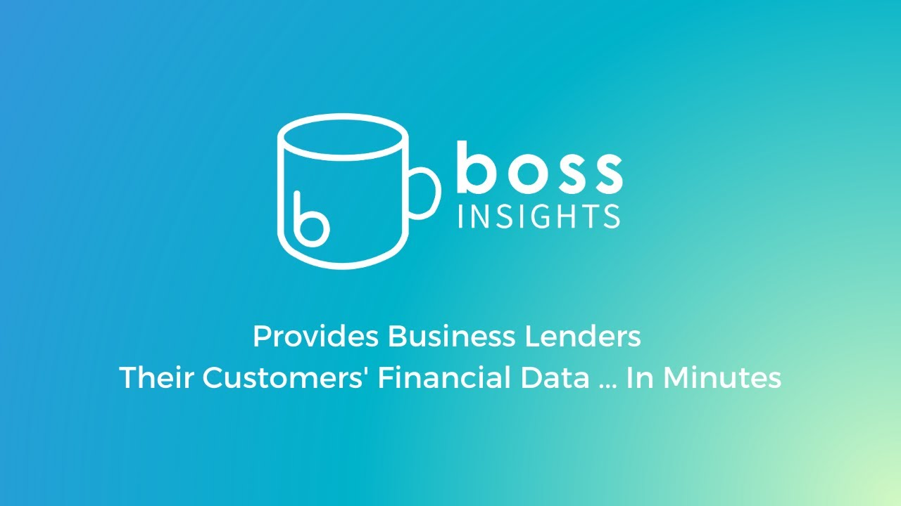

# [Boss Insights](https://bossinsights.com)

Engage and grow your business clients - Qualify, engage and support your business clients with streamlined workflows and actionable insights based on standardized Open Finance datasets.

Boss Insights is an award-winning leader in open banking, linking fintechs, neobanks, and financial institutions to their business clients' financial accounting, banking, commerce/sales, KYB, payroll, tax/IRS data, and more. Boss Insights has earned media coverage by American Banker, Forbes, Bank Innovation, Open Finance World, and The Financial Brand. Boss Insights has won multiple awards including Money 20/20 Rise Up, CB Insights' Top 35 Future in Fintech, Corporate LiveWire's Lending Technologist Of The Year, Open Banking Excellence's SME Award, Women In Payments' Unicorn Challenge, Corporate Vision's Most Innovative Leader In Lending Technology & Canadian Lenders Association's Executive Leader In Lending.

