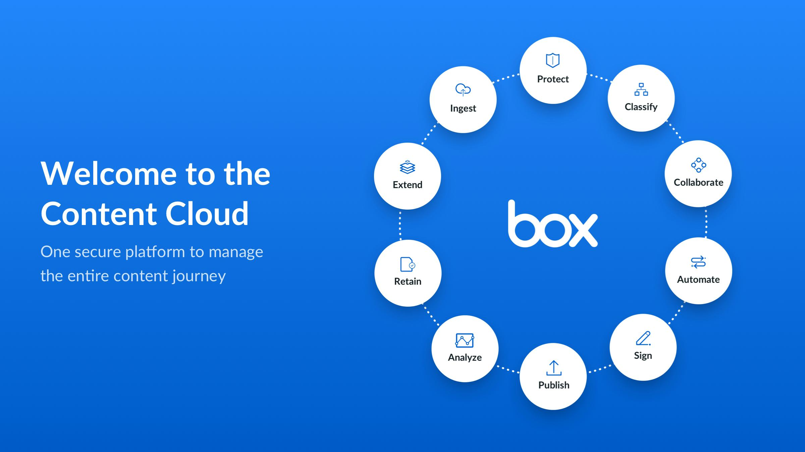
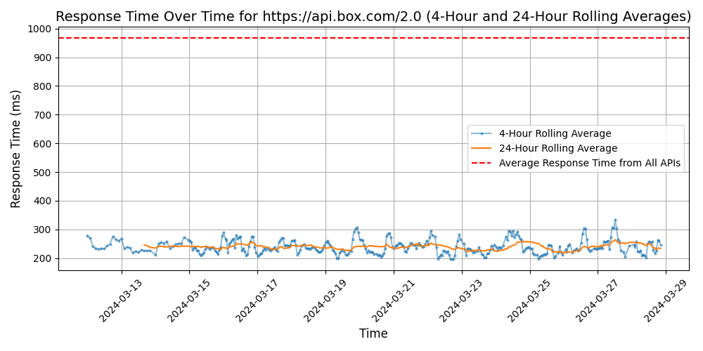

# [Box](https://box.com)

Box (NYSE:BOX) is the Cloud Content Management company that empowers enterprises to revolutionize how they work by securely connecting their people, information and applications. Founded in 2005, Box powers more than 87,000 businesses globally, including AstraZeneca, General Electric, P&G, and The GAP. Box is headquartered in Redwood City, CA, with offices across the United States, Europe and Asia. To learn more about Box, visit http://www.box.com/.

## Response Times

#### [api.box.com/2.0](https://api.box.com/2.0)

