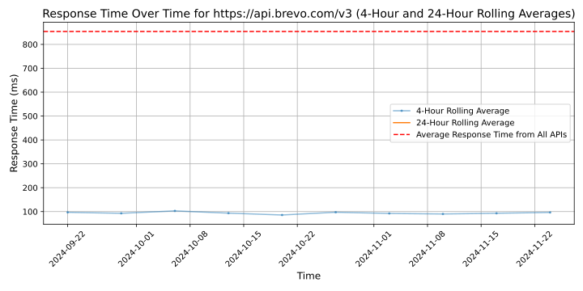

# [Brevo](https://brevo.com)

Brevo, formerly known as Sendinblue, is the leading customer relationship management (CRM) suite designed to fully cultivate long-term customer relationships and to empower businesses to expand in a fast changing digital world. With Brevo, businesses have a unified view of the customer journey in one easy-to-use platform to grow meaningful relationships.

🙌Brevo Fun Facts 🙌
- Founded in 2012 by Armand Thiberge with a mission to help businesses of all sizes build stronger customer relationships and grow beyond their wildest dreams
- 500,000 customers across 180 countries 
- Fully compliant with GDPR regulations
- Service and platform available in six languages
- Headquartered in Paris with eight other offices in Seattle, Toronto, Berlin, Vienna, Sofia, Noida, and Bengaluru
- 700+ talented employees representing over 67 nationalities
- Continuous efforts to reduce and monitor its carbon footprint
- Achieved centaur status—$100M in ARR—in 2022 
- Award wins include Top 100 Software Company by The Software Report (TSR), Stevie Award: Relationship Management Solution, MarTech Breakthrough Award: Best Overall Marketing Automation Platform, G2: Leader Winter, Leader Enterprise Winter, Best Results Mid-Market, Best Software Awards: Top 50 Marketing Products, Best Software Awards: Top 100 Fastest Growing Products

## Response Times

#### [api.brevo.com/v3](https://api.brevo.com/v3)

