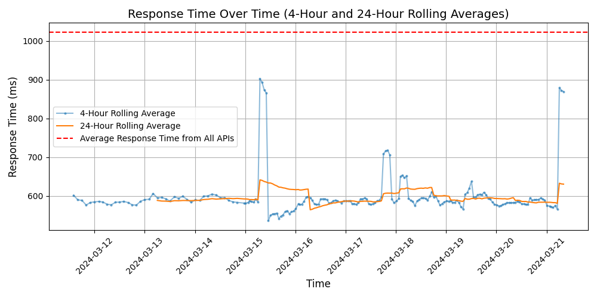

# [Brex](https://brex.com)

Brex is the AI-powered spend platform. We transform finance teams from reactive no-sayers to proactive growth drivers. With Brex, companies spend with confidence by empowering employees to make smarter financial decisions from anywhere. Brex provides corporate cards, business accounts, and global payments, plus intuitive software for travel and expenses, that make it easy to plan and track all company spend in one place, in real time. Over 20,000 companies from startups to global enterprises — including DoorDash, Flexport, and Compass — use Brex to proactively control spend, reduce costs, and increase efficiency on a global scale.

## Response Times

#### [platform.brexapis.com](https://platform.brexapis.com)

#### [platform.staging.brexapps.com](https://platform.staging.brexapps.com)

