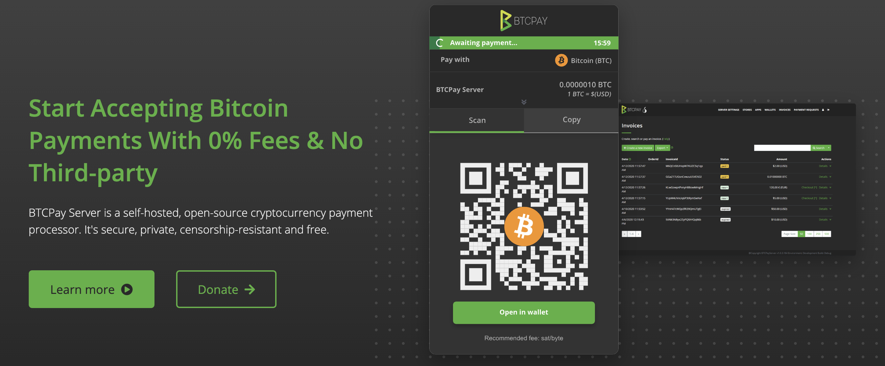

# [BTCPay Server](https://btcpayserver.org)

Start Accepting Bitcoin Payments With 0% Fees & No Third-party.

BTCPay Server is a self-hosted, open-source cryptocurrency payment processor. It's secure, private, censorship-resistant and free.

Essential Apps Built In
Features you use the most are baked right into every instance so you can hit the ground running. Create a Point-of-Sale app for your store, easily embed a tipping button on your website, send a payment link to a client across the globe, or launch a crowdfunding campaign to raise funds for your cause.

Great for Invoicing and Accounting
Generate and manage invoices with ease. Get notified when they get paid. Export your invoices in different format for smoother bookkeeping.

Native Wallet Management
Manage your incoming and outgoing funds with a built-in wallet that has hardware wallet support.

Self Host Or Use A Shared Server
Use a shared server if you're not tech savvy, or deploy your own instance on cloud servers or hardware devices. By sharing your server you can support friends or your local community.

Automation Via API
Manage your BTCPay Server (e.g. stores, invoices, users), automate your workflows and control access with our API.

