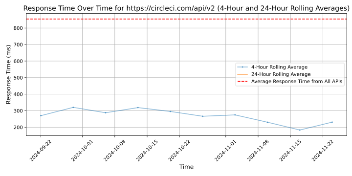

# [CircleCI](https://circleci.com)

CircleCI is the software delivery engine for teams who want to ship software faster and with confidence.
We do this today by building the world's best platform for Continuous Integration and Continuous Delivery (CI/CD). Ultimately, we plan to map every source of change for software teams, so they can accelerate innovation and growth.

Our platform was built by a team of DevOps experts who understand how critical CI/CD is to your entire development process and your entire business. The best software teams know that speed, focus, and consistency of delivery make the difference between good and great. We built CircleCI to deliver on these promises so you can deliver on yours — to reliably bring only the highest quality products to your customers.

CircleCI is proud to be an Equal Opportunity and Affirmative Action employer. We do not discriminate based upon race, religion, color, national origin, sexual orientation, gender, gender identity, gender expression, transgender status, sexual stereotypes, age, status as a protected veteran, status as an individual with a disability, or other applicable legally protected characteristics. We also consider qualified applicants with criminal histories, consistent with applicable federal, state and local law.

## Response Times

#### [circleci.com/api/v2](https://circleci.com/api/v2)

