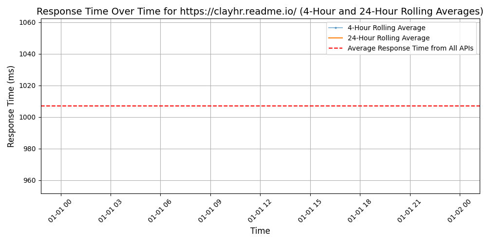

# [ClayHR](https://clayhr.com)

Gartner Cool Vendor for Human Capital Management, ClayHR is the AI powered HCM system for fast growing mid-sized enterprises.

With an open API, rich data integrations and highly configurable platform,
BizMerlinHR enables you to hire the best candidates, easily onboard your employees, guide their performance and train and retaining your best talent.

ClayHR was launched in 2013, and has customers spanning multiple industries across North America, South America, Europe, Africa and Asia Pacific.

Completely cloud based application available via your favorite web browsers and native iOS and Android mobile apps. 100+ integrations with JIRA, Salesforce, FreshBooks, QuickBooks, Slack and others.

## Response Times

#### [clayhr.readme.io/](https://clayhr.readme.io/)

