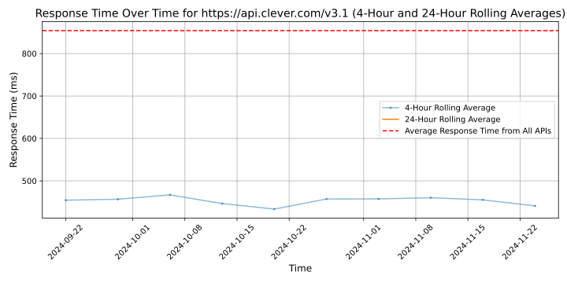

# [Clever](https://clever.com)

We believe technology is a powerful lever to make education equitable for all and the fastest way to improve educational outcomes now.

Clever is on a mission to unlock new ways to learn for all students. More than 75% of U.S. K-12 schools now use Clever to simplify access and improve engagement with digital learning. With our free platform for schools and a network of leading application providers, we're committed to advancing educational equity.  Clever has offices in San Francisco, CA and Durham, NC but you can visit us at clever.com anytime or follow us on Twitter @Clever.

Together, we're solving extremely challenging problems that the education system has been facing for decades. It's important that we also enjoy the journey. At Clever, we create a space for purposeful collaboration and plenty of fun. Our Culture Tenets encourage every person on our team to learn, grow, and create change at work.

We go to work every day striving to improve education for millions of kids. Join us!

## Response Times

#### [api.clever.com/v3.1](https://api.clever.com/v3.1)

