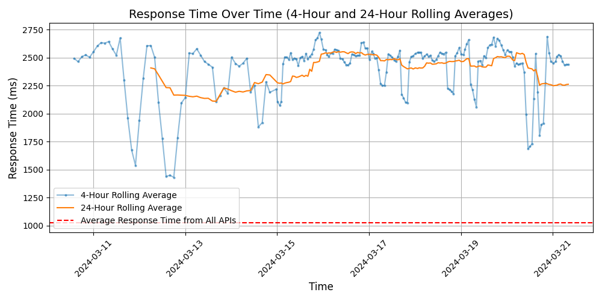
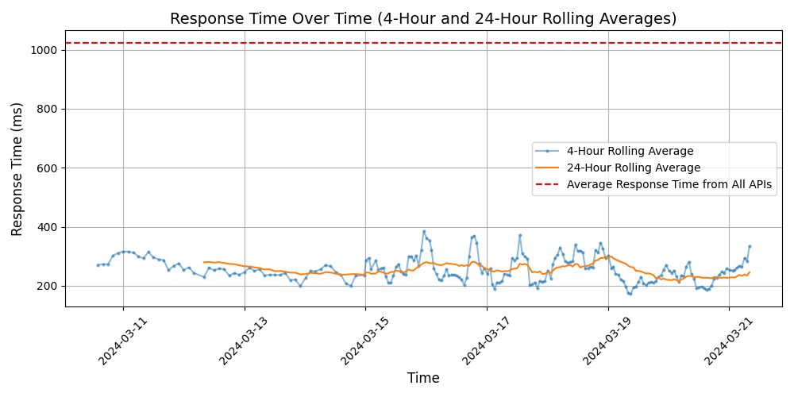

# [ClickUp](https://clickup.com)

ClickUp is a productivity platform that allows teams to manage tasks, documents, goals, and chat all in one place. With customizable features and integrations, ClickUp aims to streamline workflows and improve collaboration within organizations of all sizes.

## Response Times

#### [a00fb6e0-339c-4201-972f-503b9932d17a.remockly.com](https://a00fb6e0-339c-4201-972f-503b9932d17a.remockly.com)

#### [api.clickup.com/api/v2](https://api.clickup.com/api/v2)

