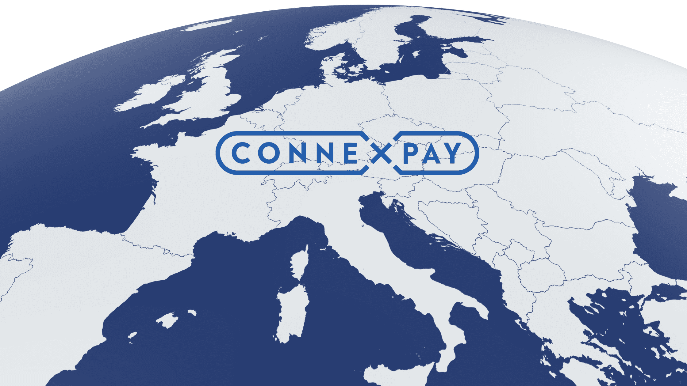

# [ConnexPay](https://connexpay.com)

ConnexPay is the first and only company to bring together the two sides of the payment process—payments acceptance and virtual payments issuing—into a single platform with one contract and one reconciliation.

The flexibility of this technology allows clients to adopt the full end-to-end acquiring and issuing solution or leverage ConnexPay's innovative intelligent routing issuing-only platform.

Through innovative and patent-pending payments technology, ConnexPay provides reduced payments risk, a new source of revenue, automated reconciliation, and guaranteed lower merchant processing fees—all while avoiding large lines of credit or prepayments.

Founded in 2017, ConnexPay is a leading payments provider for travel agencies and brokers, ecommerce providers, online marketplaces, and more.

