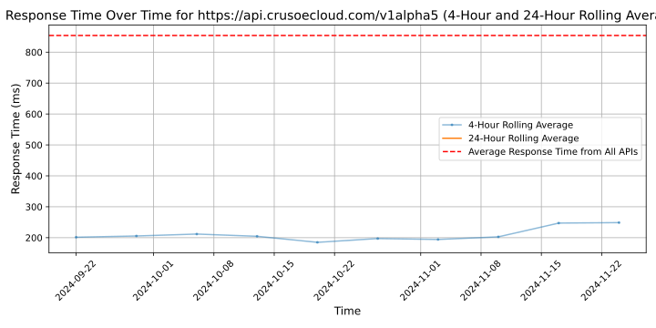

# [Crusoe](https://crusoecloud.com)

Crusoe exists to bring energy to ideas. We are the pioneers of clean computing infrastructure that reduces both the costs and the environmental impact of the world's expanding digital economy. By unlocking stranded sources of energy to power cloud and data center services, we are creating the climate-aligned future of compute-intensive innovation that reduces rather than adds to emissions. The world's appetite for computation, energy, and progress will never stop growing. Crusoe is here to bring energy to ideas in ways that are aligned with the needs of our climate.

## Response Times

#### [api.crusoecloud.com/v1alpha5](https://api.crusoecloud.com/v1alpha5)

