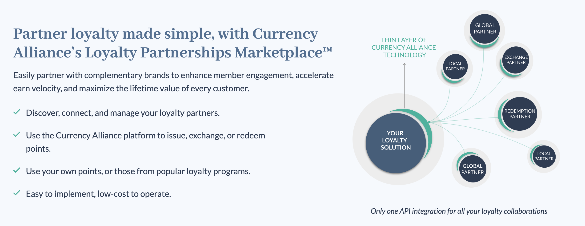
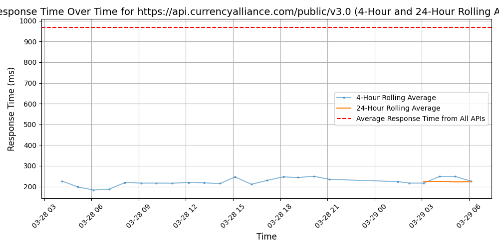
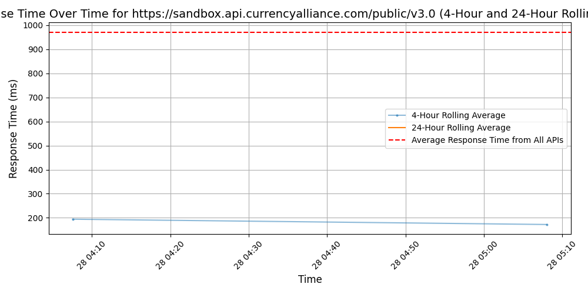

# [Currency Alliance](https://www.currencyalliance.com)

Loyalty programs once worked miracles for customer engagement.

But with a dizzying range of disjointed loyalty schemes from countless brands, the majority of customers now rarely earn enough points with any one brand to put them to good use.

So, at the start of 2015, our team set out to create a new global loyalty ecosystem.

We're helping customers and brands alike discover the elusive customer loyalty that had become lost among less frequent customers.

We are accelerating the customer's journey to rewards by making it easier for them to earn and spend points with a wider range of brands.

Brands, meanwhile, benefit from the insights of a larger network, and the tools needed to enable better experiences for their most loyal customers.

And, more importantly, our partners can discover those less frequent customers who - with the right incentives - can become loyal advocates.

## Response Times

#### [api.currencyalliance.com/public/v3.0](https://api.currencyalliance.com/public/v3.0)

#### [sandbox.api.currencyalliance.com/public/v3.0](https://sandbox.api.currencyalliance.com/public/v3.0)

