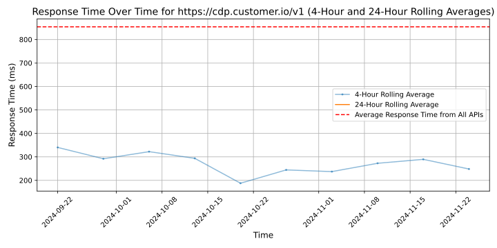

# [Customer.io](https://customer.io)

Customer.io is a versatile marketing automation tool for sending relevant messages based on behavior across web and mobile products.

Impersonal messages lead to bad experiences. That's why we use real-time data to help you deliver the right message, exactly when it's needed — like sending an event reminder over SMS or the perfect onboarding email.

Our robust platform enables you to:
- Automate your product messaging, with the ability to build, test, and send messages from one platform.
- Create and manage newsletters, transactional messages, and behavioral messages
- Do more with your behavior and data -- connect our powerful segmentation and automation engine with other apps to drive user behavior and save time.

Learn more: https://customer.io

## Response Times

#### [cdp.customer.io/v1](https://cdp.customer.io/v1)

