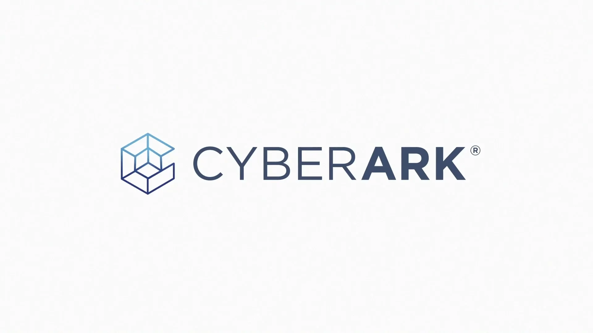

# [CyberArk](https://cyberark.com)

CyberArk is the global leader in Identity Security. Centered on privileged access management, CyberArk provides the most comprehensive security offering for any identity – human or machine – across business applications, distributed workforces, hybrid cloud workloads and throughout the DevOps lifecycle. The world's leading organizations trust CyberArk to help secure their most critical assets.

For over a decade CyberArk has led the market in securing enterprises against cyber attacks that take cover behind insider privileges and attack critical enterprise assets. Today, only CyberArk is delivering a new category of targeted security solutions that help leaders stop reacting to cyber threats and get ahead of them, preventing attack escalation before irreparable business harm is done. At a time when auditors and regulators are recognizing that privileged accounts are the fast track for cyber attacks and demanding stronger protection, CyberArk's security solutions master high-stakes compliance and audit requirements while arming businesses to protect what matters most.

With offices and authorized partners worldwide, CyberArk is a vital security partner to more than 6,770 global businesses, including:

More than 50% of the Fortune 500
More than 35% of the Global 2000

CyberArk has offices in the U.S, Israel, U.K., Singapore, Australia, France, Germany, Italy, Japan, Netherlands and Turkey.

