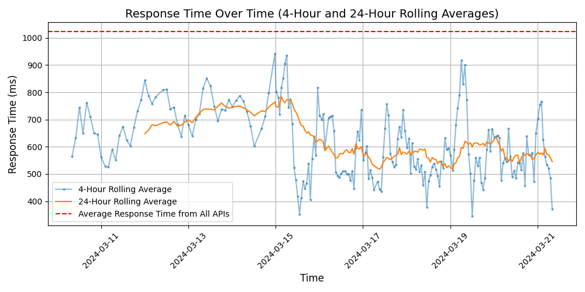

# [DEV](https://dev.to)

DEV is a community of software developers where they can share knowledge, collaborate, and learn from each other. It's a platform for writing, reading, and discussing code and software development topics. DEV also provides resources, tools, and opportunities for developers to grow their skills and network with industry professionals.

## Response Times

#### [dev.to/api](https://dev.to/api)

