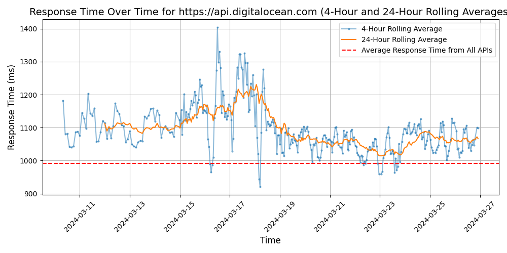

# [DigitalOcean](https://digitalocean.com)

DigitalOcean is a cloud infrastructure provider that offers virtual servers, storage, networking, and more to help developers deploy and scale applications quickly and easily. Known for its simplicity and developer-friendly tools, DigitalOcean is used by startup companies, independent developers, and enterprises alike to power a wide range of web applications and services.

## Response Times

#### [api.digitalocean.com](https://api.digitalocean.com)

