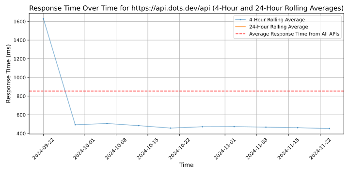

# [Dots](https://dots.dev)

Dots is building a multichannel payouts API for marketplaces. Our API lets a marketplace pay their sellers in the ways they want to be paid, including Venmo, Paypal, ACH and Zelle. As more Americans earn a living by becoming a 1099 worker, marketplaces need to provide flexible payout options and we make supporting these payouts easy through a single API.

## Response Times

#### [api.dots.dev/api](https://api.dots.dev/api)

