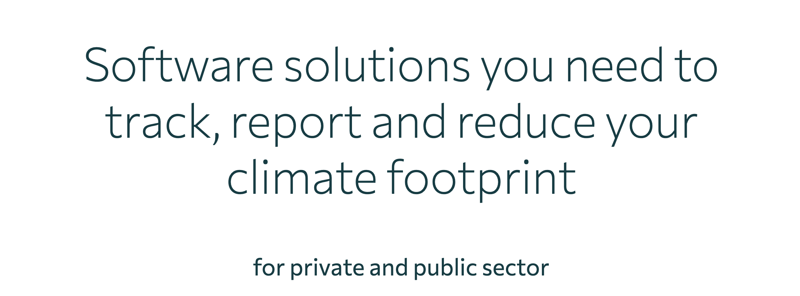
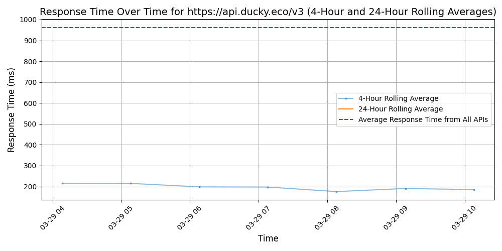

# [Ducky](https://www.ducky.eco)

Hello there! 👋🏼 We're Ducky, climate enthusiasts passionate about steering the world towards data-driven climate action. We empower YOU to seamlessly track, reduce, and report your climate emissions with our intuitive software solutions.

💪🏼 So far, we've assisted over 300 organisations and 90,000 individuals worldwide in becoming more sustainable – and we'd love to help you, too!

Would any of our solutions be suitable for you?👇🏽

🌍 Seamless Climate Reporting:
Initiate climate reporting easily, quickly, and at an affordable price! Our platform automates climate reporting according to all requirements, ensuring excellent results with just a few clicks and a user-friendly interface.

🚲 Holistic Mobility Data:
In collaboration with Telia, we provide data to assist mobility planners and property developers in transitioning to a sustainable mobility system in your city. Track travel patterns and measure the climate impact of changes over time.

🌱 Climate Campaign Manager:
Turn climate actions into a fun, team-building, and engaging process. Set up educational climate challenges within your company and foster a culture where climate action feels like a shared responsibility.

🎯 We focus on consumption-based carbon emissions.
🦆 Our team comprises 18 dedicated climate enthusiasts.
📍 We have offices in Trondheim and Oslo.
💬 Get in touch with us via DM or through our website: www.ducky.eco

## Response Times

#### [api.ducky.eco/v3](https://api.ducky.eco/v3)

