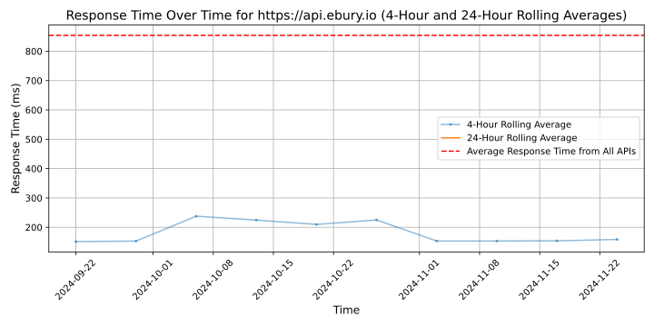

# [Ebury](https://ebury.com)

Ebury is a Fintech company specialised in international payments, collections, and foreign exchange services. It offers financial solutions aimed mainly at SMEs and midcaps. Ebury offers foreign exchange activity in over 130 currencies - for both major and emerging markets - as well as cash management strategies, trade finance, and foreign exchange risk management.

Founded in London in 2009 by Spanish engineers Juan Lobato and Salvador García, the company has grown its global market presence to a network of 31 offices in 21 countries and more than 1,300 employees.

Throughout its history, the company has received more than 20 international awards, including the Financial Times 1000 Europe's fastest-growing companies 2020 and The Sunday Times Tech Track 100. All these recognitions place Ebury as one of the leading European financial technology companies.

ebury.com

## Response Times

#### [api.ebury.io](https://api.ebury.io)

