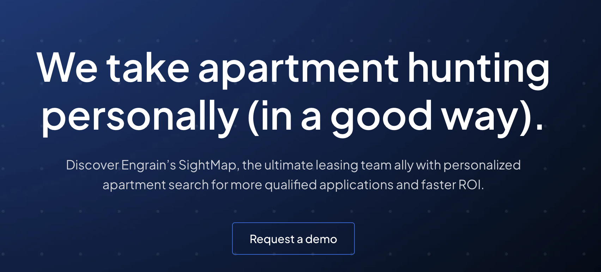
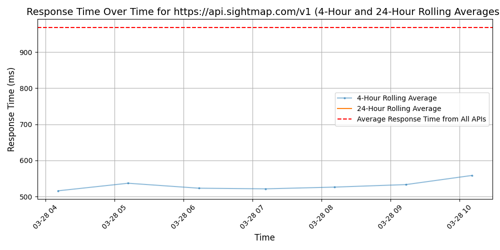

# [Engrain](https://www.engrain.com/sightmap)

Engrain is a recognized leader in next-generation interactive technology and data visualization software solutions for the multifamily, commercial, residential, storage, and retail real estate industries. The company is best known for its award-winning TouchTour® suite of products – including interactive sales kiosks, the TouchTour iPad application, and TouchTour Connect digital signage – which engage prospects and residents alike while empowering sales teams with actionable, real-time information.

Through its innovative SightMap™ data visualization software platform, Engrain is poised to disrupt the real estate industry once again with a lightweight map format that displays unit-level data in a highly responsive and integrated way. SightMap can be embedded on virtually any website or application and is available on all Engrain's TouchTour products.  It is also available for license by individual companies as a powerful asset management tool, and third-party software providers for inclusion in marketing and operations dashboards, applications, analytics tools and websites via an SDK and Unit Map data API.

## Response Times

#### [api.sightmap.com/v1](https://api.sightmap.com/v1)

