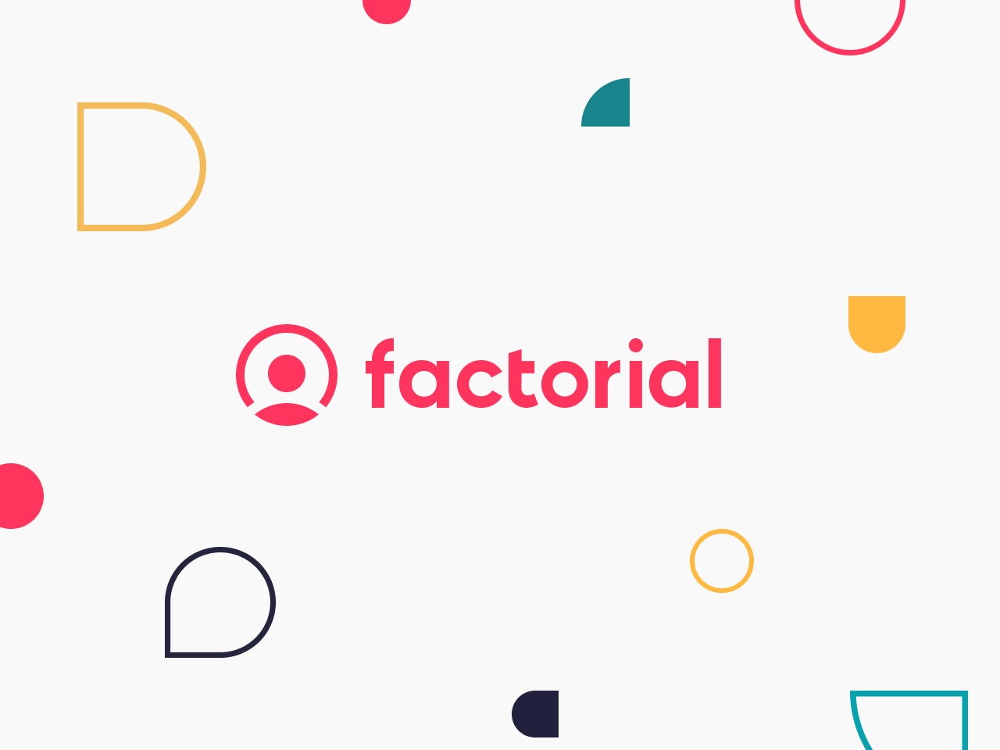
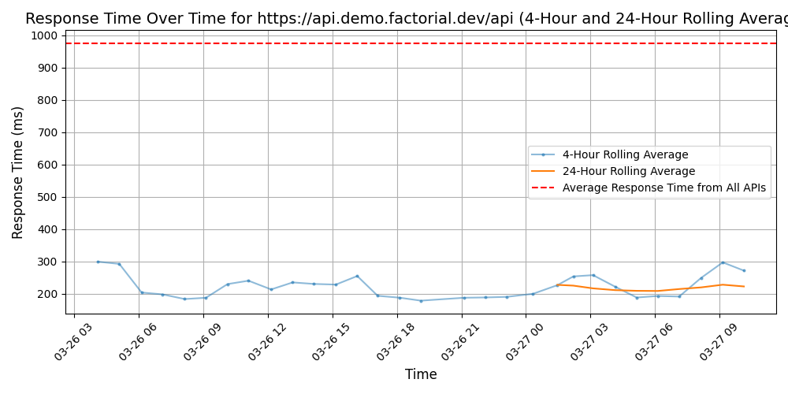
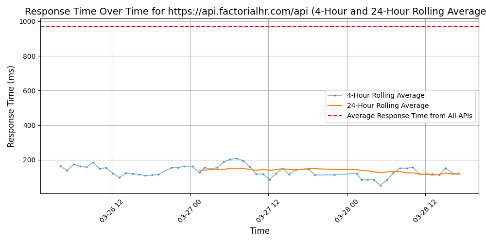

# [Factorial](https://factorialhr.com)

With over 8,000 clients worldwide, Factorial is one of the leading HR softwares for SMEs. We provide intuitive HR solutions that automate and centralize administrative tasks to provide insights and help your business run smoothly.

Factorial was founded in 2016 in Barcelona and experienced quick growth due to the fact that so many businesses face the same challenge: wasting time on never-ending manual tasks. A few years later, in 2022, Factorial became a Unicorn, propelling us forward to continue on our mission of providing your business with a one-stop-shop solution for all people processes.

Factorial offers solutions like time management, talent management, recruitment, expenses, analytics, document management to name a few. Our all-in-one, user friendly platform makes it easier for businesses to focus on matters, the people within it.

## Response Times

#### [api.demo.factorial.dev/api](https://api.demo.factorial.dev/api)

#### [api.factorialhr.com/api](https://api.factorialhr.com/api)

