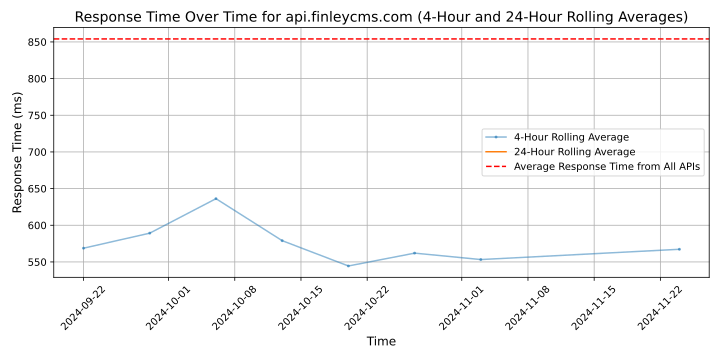

# [Finley](https://finleycms.com)

Finley's software simplifies debt capital raise and management for businesses. High-growth startups like Ramp, Even, and Arc rely on Finley to manage over $2 billion in debt capital. By automating due diligence, ensuring compliance, and streamlining ongoing reporting with capital providers, Finley helps ensure that companies always have access to funding when they need it. Finley's investors include Y Combinator, Bain Capital Ventures, Haystack, Nine Four Ventures, and TwentyTwo VC.

## Response Times

#### [api.finleycms.com](https://api.finleycms.com)

