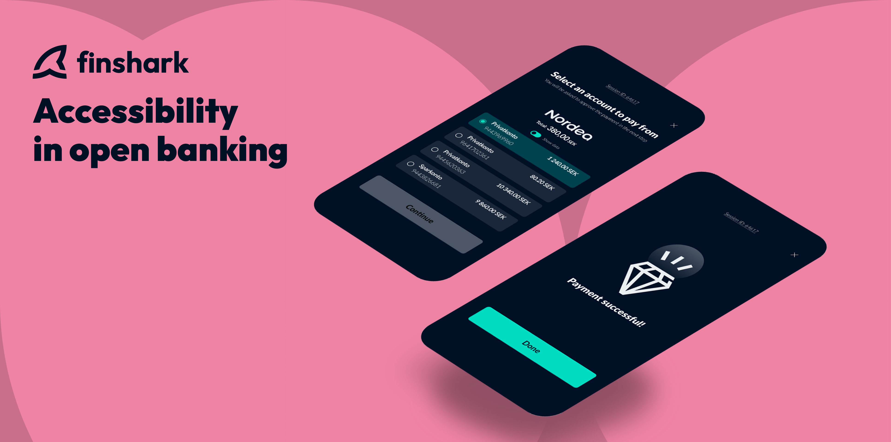
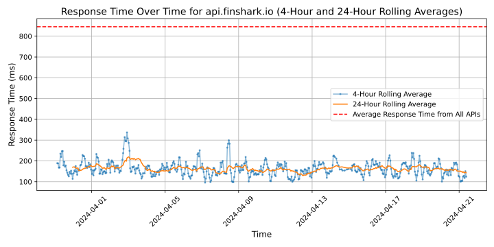

# [Finshark](https://finshark.io)

More and more non-financial companies are looking into new ways to boost revenue through embedded finance as the financial services industry has been disrupted. Through open banking, we remove any legacy friction within online payments and other financial processes to create new, instant paths for modern companies to fully own finance, deliver proprietary solutions and, ultimately, reach the success they desire.

𝗜𝗻𝘀𝘁𝗮𝗻𝘁 𝗽𝗮𝘆𝗺𝗲𝗻𝘁𝘀. | Let your customers pay with their bank.
𝗜𝗻𝘀𝘁𝗮𝗻𝘁 𝗽𝗮𝘆𝗼𝘂𝘁𝘀. | Send funds to anyone from your business.
𝗣𝗿𝗲𝗺𝗶𝘂𝗺 𝗶𝗻𝘀𝗶𝗴𝗵𝘁𝘀. | Holistic financial data to streamline your KYC checks.
𝗦𝘁𝗿𝗲𝗮𝗺𝘀. | All our products rolled into one single interface. Zero coding.

Finshark is a licensed Payment Institution by the Financial Supervisory Authority, authorised to provide payment services across EU/EES.

## Response Times

#### [api.finshark.io](https://api.finshark.io)

