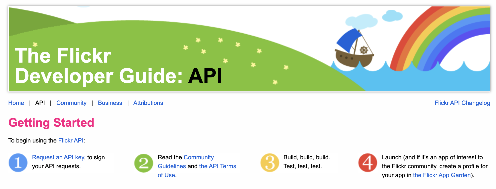
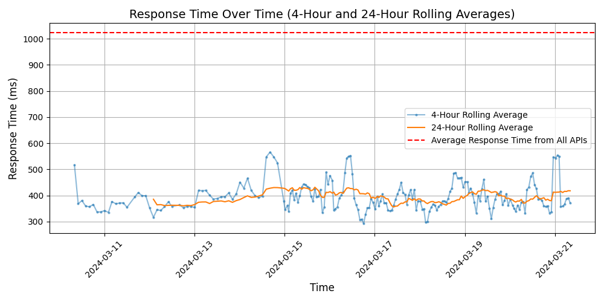

# [Flickr](https://flickr.com)

Flickr is an image hosting and video hosting website, web services suite, and online community platform. It was one of the earliest Web 2.0 applications. Flickr allows users to share and embed personal photographs and videos, and to interact with other members through commenting, groups, and more.

## Response Times

#### [api.flickr.com/services](https://api.flickr.com/services)

