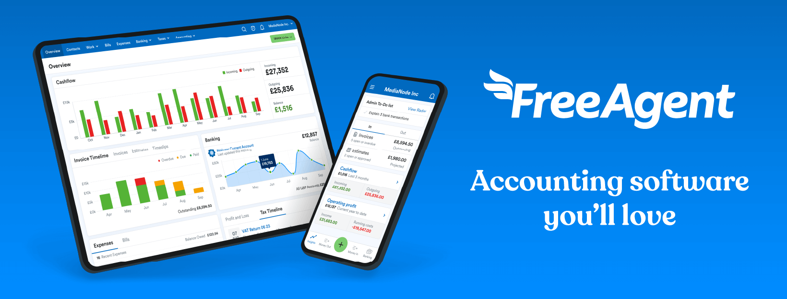
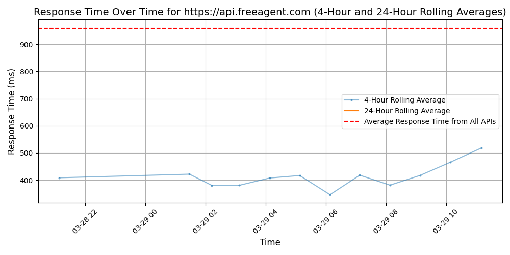

# [FreeAgent](https://freeagent.com)

One product.🤳 17 years. 📆 250+ employees. 🧑‍💻Over 150,000 users. 💥There's so much to say about it all. But here's the version that fits the character limit.

We're FreeAgent. 👋 We make award-winning accounting software and provide superstar support for small businesses and their accountants and bookkeepers. We're a friendly bunch with a single goal bringing us all together: making users happier and more successful by putting them in control of their finances.

But how did we get here? 🤔 You might remember 2007 as the year the first iPhone, Kindle and Fitbit debuted. It was also the year FreeAgent was launched.💡 Founders Ed, Olly and Roan had all been working as freelance designers or developers for a while. They created FreeAgent out of the frustration that doing the books was just too damn difficult for most of us. So they put their heads together and decided that there must be a better way to deal with their mounting piles of invoices, spreadsheets and receipts.

Since our first hire back in 2008, we've also worked hard to make FreeAgent a ✨great✨ place to work.  We've grown to over 250 employees and we continue to build a diverse, high-performing, happy and collaborative team.

In early 2018,  the company was acquired by the NatWest Group. Our growth has been given a turbo boost, yet we remain operationally independent of the group. 🚀

Today, FreeAgent helps over 150,000 users take care of their finances - from the daily admin to big-picture planning - and do it all happily and successfully. Just like Ed, Olly and Roan set out to do all those years ago. 💙

## Response Times

#### [api.freeagent.com](https://api.freeagent.com)

