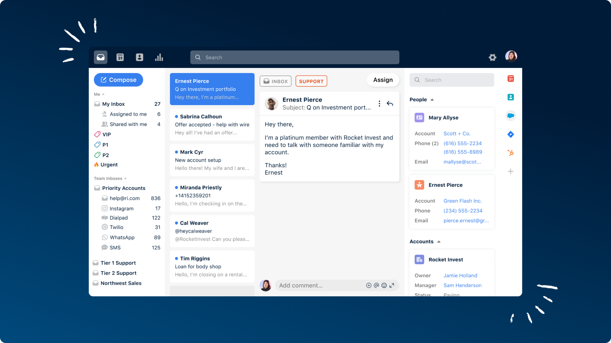
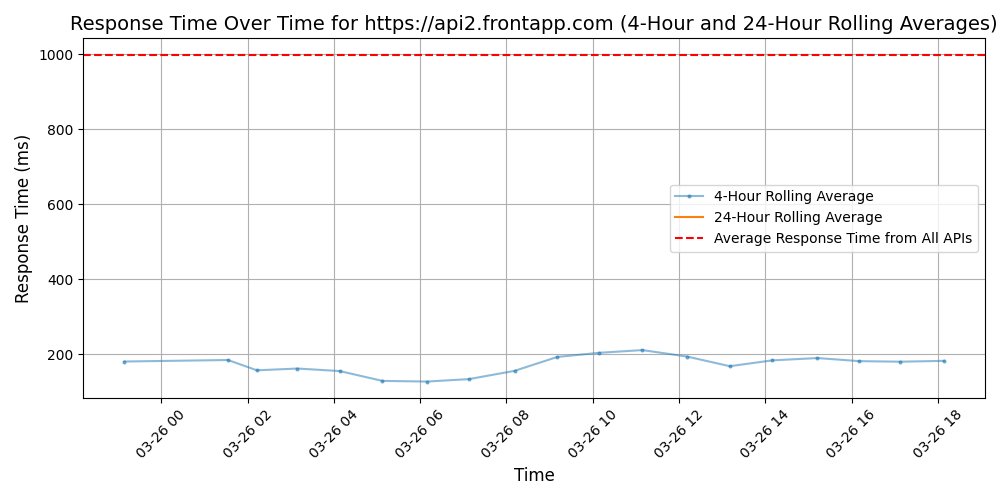

# [Front](https://front.com)

Front is a customer operations platform that enables support, sales, and account management teams to deliver exceptional service at scale. Front streamlines customer communication by combining the efficiency of a help desk and the familiarity of email, with automated workflows and real-time collaboration behind the scenes.

With Front, teams can centralize messages across channels, route them to the right person, and unlock visibility and insights across all of their customer operations. More than 8000 businesses use Front to drive operational efficiency that prevents churn, improves retention, and propels customer growth.

## Response Times

#### [api2.frontapp.com](https://api2.frontapp.com)

