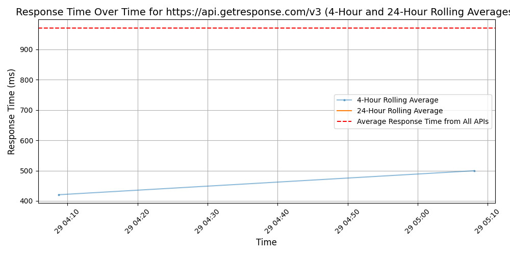
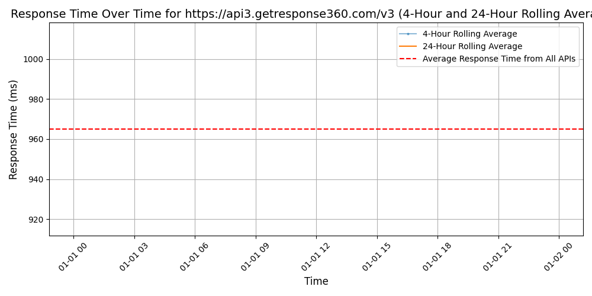
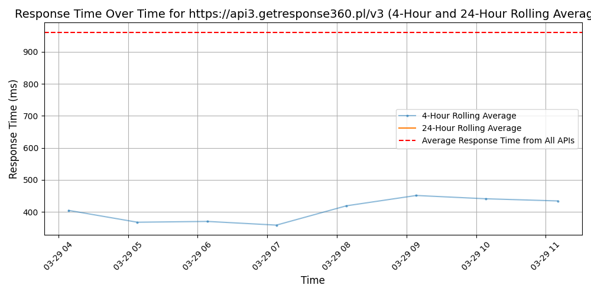

# [GetResponse](https://getresponse.com)

GetResponse is a comprehensive email marketing platform that provides small businesses, solopreneurs, coaches, and marketers with powerful and affordable tools to grow their audience, engage with their subscribers, and turn subscribers into paying customers. With over 25 years of expertise, our customers choose GetResponse for our user-friendly solution, award-winning 24/7 customer support, and powerful tools that go beyond email marketing  – with automation, list growth, and additional communication tools like webinars and live chats to help businesses build their personal brand, sell their products and services, and build a community.

GetResponse's powerful email marketing software includes AI-enhanced content creation tools, professional templates, easy-to-use design tools, and proven deliverability. Our customers are empowered with tools to build a website and unlimited landing pages, and create engaging pop-ups and signup forms. The marketing automation builder brings your ideal automated communication scenario to life with a visual builder that can grow with your needs.

With our easy-to-use platform, proven expertise, and focus on user-friendly solutions, GetResponse is the ideal tool for small businesses, solopreneurs, coaches, and marketers looking to grow their audience, sell their products and services, and engage with their subscribers in a meaningful way.

## Response Times

#### [api.getresponse.com/v3](https://api.getresponse.com/v3)

#### [api3.getresponse360.com/v3](https://api3.getresponse360.com/v3)

#### [api3.getresponse360.pl/v3](https://api3.getresponse360.pl/v3)

