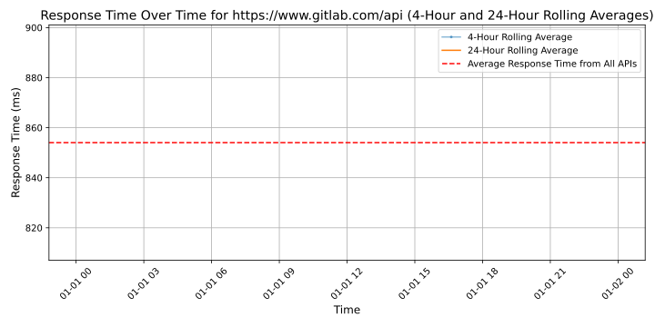
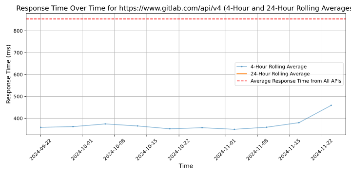

# [GitLab](https://gitlab.com)

GitLab is a complete DevOps platform, delivered as a single application, that provides teams a way to collaborate, build, and deploy their software. With GitLab, you can automate the entire DevOps lifecycle from planning and creating code to testing, releasing, and monitoring applications.

## Response Times

#### [www.gitlab.com/api](https://www.gitlab.com/api)

#### [www.gitlab.com/api/v4](https://www.gitlab.com/api/v4)

