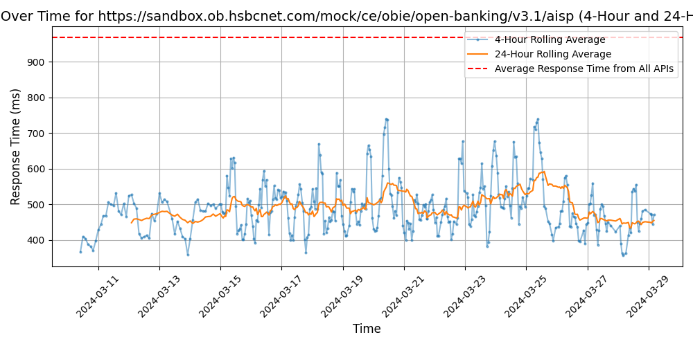

# [HSBC](https://hsbc.com)

HSBC, also known as The Hongkong and Shanghai Banking Corporation, is a multinational banking and financial services organization. It offers a wide range of services including retail banking, wealth management, commercial banking, and global banking and markets. HSBC operates in numerous countries and territories, serving millions of customers worldwide with its comprehensive banking solutions.

## Response Times

#### [sandbox.ob.hsbcnet.com/mock/ce/obie/open-banking/v3.1/aisp](https://sandbox.ob.hsbcnet.com/mock/ce/obie/open-banking/v3.1/aisp)

