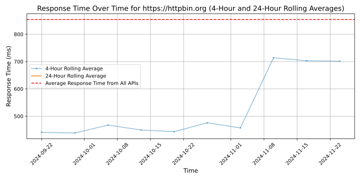

# [httpbin](httpbin.org)

httpbin is a simple HTTP request and response service that provides a variety of endpoints to test HTTP methods, headers, and status codes. It is useful for developers to debug and test their HTTP client libraries and tools. httpbin allows users to simulate different scenarios and observe the behavior of their HTTP requests in a controlled environment.

## Response Times

#### [httpbin.org](https://httpbin.org)

