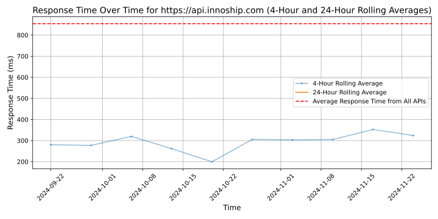

# [Innoship](https://innoship.io)

Innoship is the advanced delivery management platform that helps retailers to improve customer experience by streamlining the delivery process. We combined our eCommerce logistics expertise with all the enterprise features you need to master last-mile customer experience. 

Backed by Abris Capital Partners, the ESG transformation specialist private equity investor, Innoship is now part of Alsendo group, the leading eCommerce shipping solutions technologies in the CEE region.

From checkout and shipping to tracking, returns and analytics, Innoship helps you safely deliver on promises made to your customers. 

Effortless integration, hassle-free delivery
•	A simple, one-time integration with the Innoship app allows retailers to access any carrier, local or international.
•	External markets become readily available with seamless connections to hundreds of carriers in 15+ countries.

## Response Times

#### [api.innoship.com](https://api.innoship.com)

