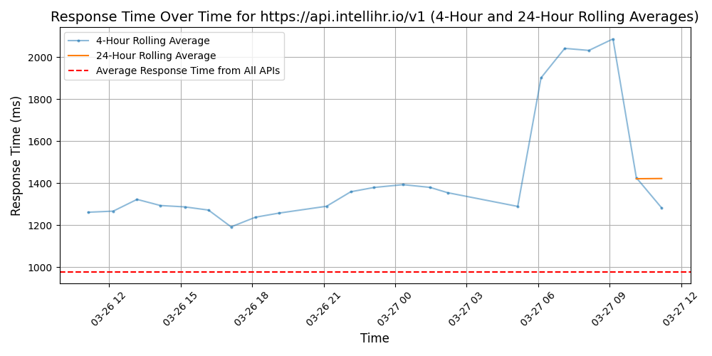

# [intelliHR](https://intellihr.com)

IntelliHR, a Humanforce company, is an intelligent people platform that's revolutionising human resources management by empowering global HR leaders to foster inclusive, engaging, high-performing, and aligned workplace cultures.

Designed for today's hybrid work environment, intelliHR's cloud-based platform seamlessly enhances employee engagement, performance, and retention. With ease of implementation, best-of-breed integrations, and robust data-driven capabilities, intelliHR is the preferred HR software for hundreds of forward-thinking organisations and 70,000 users globally. 

Ideal for mid-to-large-sized businesses, intelliHR offers comprehensive features, including:
•	centralised data management
•	seamless onboarding
•	automated reviews
•	goal tracking
•	continuous feedback
•	engagement surveys
•	compliance management

Its full configurability ensures a tailored fit for specific needs, while advanced people analytics empower HR leaders and executive teams to make informed, strategic decisions. IntelliHR is not just software; it's a strategic partner dedicated to optimising workforce management and creating impactful workplace experiences for sustained success across diverse industries and geographies.

## Response Times

#### [api.intellihr.io/v1](https://api.intellihr.io/v1)

