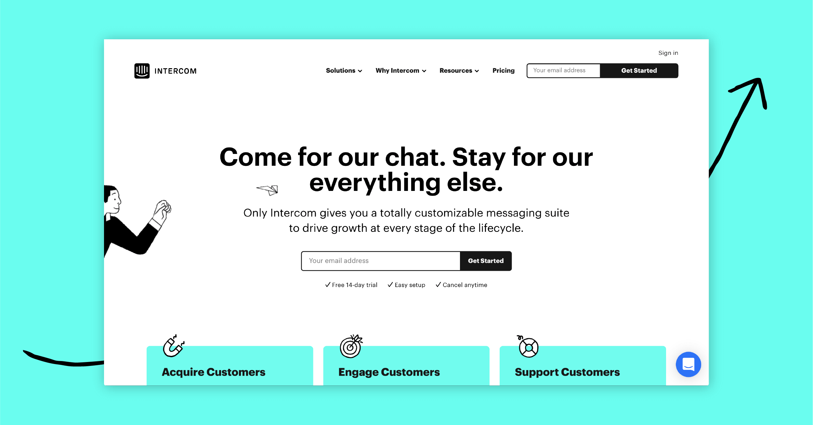
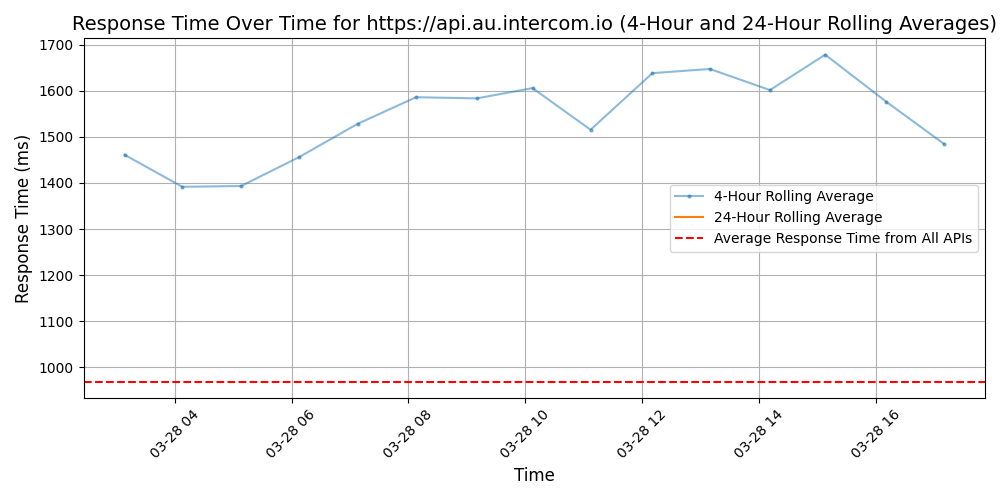
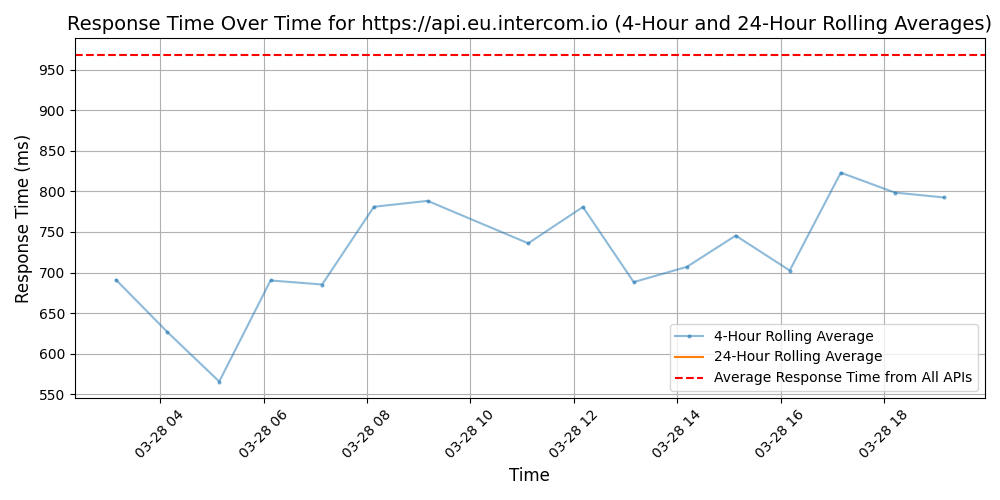
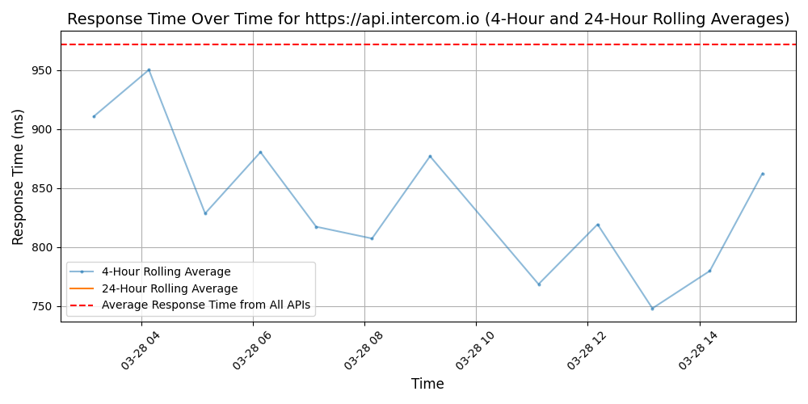

# [Intercom](https://intercom.com)

Intercom is the only complete Customer Service solution that provides a seamless customer experience across automation and human support, delivering increased customer satisfaction while reducing costs. We're building a future where most customer conversations are successfully resolved without needing human support, freeing up the team to work on higher value customer conversations.

More than 25,000 global organizations, including Atlassian, Amazon and Lyft Business, rely on Intercom to deliver unparalleled user experiences at any scale. Intercom's platform is used to send over 500 million messages per month and enables interactions with over 600 million monthly active end users.

Founded in 2011 and backed by leading venture capitalists, including Kleiner Perkins, Bessemer Venture Partners and Social Capital, Intercom is on a mission to make internet business personal.

## Response Times

#### [api.au.intercom.io](https://api.au.intercom.io)

#### [api.eu.intercom.io](https://api.eu.intercom.io)

#### [api.intercom.io](https://api.intercom.io)

