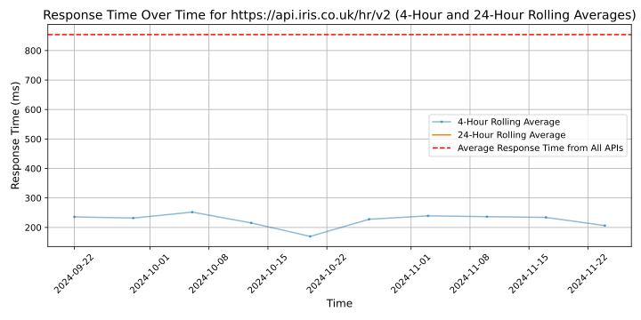

# [IRIS Software Group](https://www.iris.co.uk/products/iris-cascade)

IRIS Software Group is a leading global provider of mission critical software and services and one of UK's largest privately held software companies.

We help organisations to make better business decisions by developing integrated software solutions to minimise admin, make business processes more efficient and give more time to do what's valued.

We started 45 years ago with accountancy software and have evolved to be trusted by more than 100,000 customers in 135 countries around the world. We invest heavily in development using the latest processes and technologies, driven by our Indian and Romanian Product Development Centres to build the next generation of cloud-based accountancy, HR and education solutions.

Our global and domestic payroll and HR solutions are used nearly five million employees. Almost one million UK employees are managed by our HR solutions, and one in eight UK employees are paid through IRIS payroll solutions. We are the largest third-party online tax filer with UK Government, and we are used by 54 of the top 100 US and 91 of the top 100 UK accountancy firms. We also serve over 13,000 schools and academies, and almost five million UK families use our apps to connect to their child's school.

In the last year, we have been awarded Technology Company of the Year in the UK Tech Awards; Employer of the Year in the Thames Valley Tech Awards; and the Americas Prime Award from the K2 Enterprise Awards. IRIS Education has been named Company of the Year at the UK National MAT Awards 2023, and crowned Company of the Year (more than 12m) in the Bett Awards 2023.

## Response Times

#### [api.iris.co.uk/hr/v2](https://api.iris.co.uk/hr/v2)

