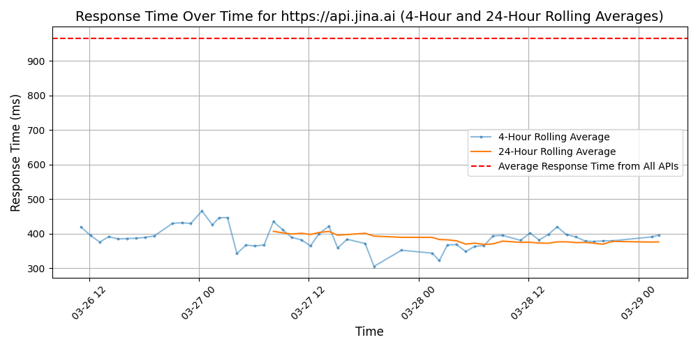

# [Jina AI](https://jina.ai)

Founded in February 2020, Jina AI has swiftly emerged as a global pioneer in multimodal AI technology. Within an impressive timeframe of 20 months, we have successfully raised $37.5M, marking our strong position in the AI industry. Our ground-breaking technology, open-sourced on GitHub, has empowered over 40,000 developers around the globe to seamlessly build and deploy sophisticated multimodal applications.

In 2023, we've made significant strides in advancing AI generation tools grounded on multimodal technology. This innovation has benefited over 250,000 users worldwide, catering to a plethora of unique business requirements. From facilitating business growth and enhancing operational efficiency to optimizing costs, Jina AI is dedicated to empowering businesses to excel in the multimodal era.

## Response Times

#### [api.jina.ai](https://api.jina.ai)

