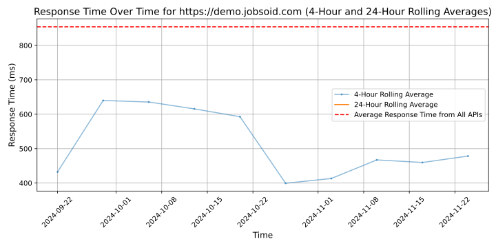

# [Jobsoid](https://jobsoid.com)

Jobsoid is an Online Applicant Tracking System (ATS) which simplifies every step of the recruitment process in organizations, streamlining everything from sourcing potential candidates to hiring the right one. Jobsoid is the only recruitment software with the ability to help save your precious time, by automatically screening candidate applications and suggesting the best fit candidates for a certain job profile in your company. Instead of manually navigating through innumerable resumes, job applications and responses, and then trying to track and manage them with spreadsheets or emails, let Jobsoid take on the workload for you.
Our software is designed to make your life and work simpler, by automating most of the work involved in recruitment and candidate shortlisting, thereby freeing up your time for the actual selection and hiring process. Based on your organization's hiring needs, you can opt for a free plan that offers all the basics, or use one of our premium plans that are customized for a variety of different recruitment and hiring requirements. Jobsoid acts as your recruitment helper right from start to finish.
Post a job opening, send automated responses and bulk emails, filter through applications, schedule interviews, set up automated backups, and much more!

## Response Times

#### [demo.jobsoid.com](https://demo.jobsoid.com)

