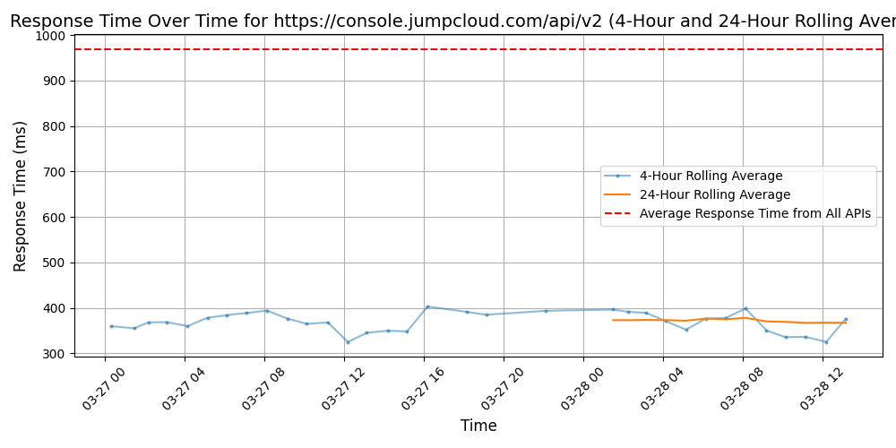

# [JumpCloud](https://jumpcloud.com)

JumpCloud is reimagining the on-prem directory as a cloud-based platform that secures identities, manages devices, and provides safe access to all types of IT resources — on-prem, in the cloud, across Windows, Mac, or Linux.

Twitter: @jumpcloud

## Response Times

#### [console.jumpcloud.com/api/v2](https://console.jumpcloud.com/api/v2)

