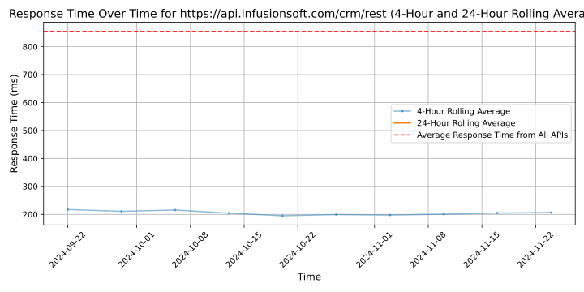

# [Keap](https://keap.com)

With Keap, you'll easily capture, organize, track, and nurture all of your leads to increase sales and revenue.

To ensure your success, Keap also offers expert coaching, in-depth training, outstanding support, and a dedicated community of entrepreneurs.

Business owners, we're here to help you grow without the growing pains. You've built your business from the ground up. And no one knows it better than you do. But while the thought of letting go terrifies you, the idea of growing excites you.

You need to scale in a way that keeps your business healthy, your customers happy, and your team thriving. Keap's powerful sales and marketing automation engine is built to do exactly that, providing automated personalization features, strategic guidance, coaching, and an active user community to help every step of the way.

For 20 years, Keap has helped empower and liberate small businesses so they can strengthen their families, communities and the global economy. Keap originally pioneered the sales and marketing automation software market under the Infusionsoft brand, and is now breaking new ground with Pro and Max editions. Headquartered in Chandler, Arizona, the company is on a mission to simplify growth for 1 million small businesses worldwide by 2030.

Recent awards:
#1 Best Products for Sales
#1 All-in-one CRM
#3 Top 50 Products for Small Businesses
Top 100 Best Workplaces for Millennials in US

## Response Times

#### [api.infusionsoft.com/crm/rest](https://api.infusionsoft.com/crm/rest)

