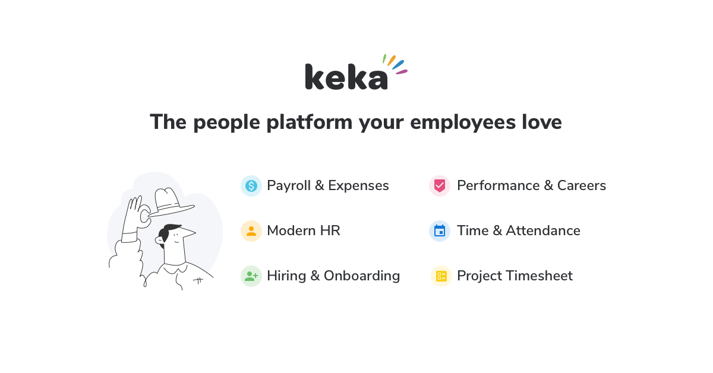

# [Keka HR](https://keka.com)

Here's our story,

It all began with the frustration of using software that sucks. Prior to starting Keka, our core team was a 100 person business that needed an easy to use software for managing employees. We looked everywhere and all we found were software that was lousy and hard to use. We felt SME businesses in India deserved something better. Something awesome actually!

Thus emerged Keka!

